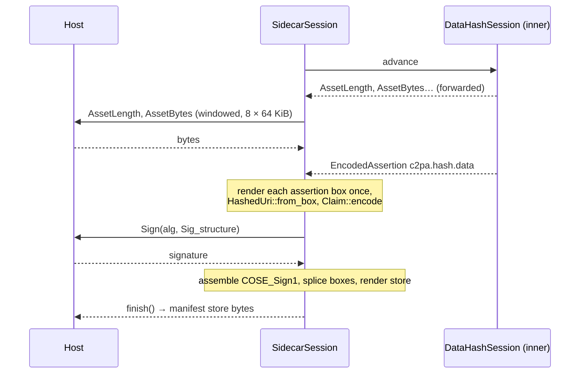

# contentauth-c2pa-sidecar-builder

Builds and signs a **sidecar** C2PA manifest store — a `.c2pa` file beside
an asset, bound to it by hash rather than embedded in it — as a sans-I/O
session composed of independent elements.

It reproduces the use case of Gavin Peacock's
[`c2pa-sign-sample`](https://github.com/gpeacock/c2pa-core/tree/main/c2pa-sign-sample)
(c2pa-core): a `c2pa.hash.data` hard binding over the whole file, a
`c2pa.actions.v2` assertion recording `c2pa.created`, a v2 claim
referencing both, and an Ed25519 `COSE_Sign1` over the claim from a freshly
generated CA + end-entity chain. Run it:

```sh
cargo run -p contentauth-c2pa-sidecar-builder --example sign_sidecar -- photo.jpg
# → photo.c2pa, photo.ca.pem  (the CA is anchored to nothing; trust it explicitly)

# validate it with c2patool (checked against 0.28.2 → validation_state "Trusted");
# `trust` is a subcommand, so it follows the asset and its options:
c2patool photo.jpg --external-manifest photo.c2pa trust --trust_anchors photo.ca.pem
```

Leave off `trust …` and c2patool reports `signingCredential.untrusted`, with
everything else (claim signature, hashed URIs, `assertion.dataHash.match`)
still valid. (The input should be an asset with no manifest of its own, or
c2patool has two to choose between; `--external-manifest` overrides it.)

## Elements, not a monolith

| Element | Where | Knows |
|---|---|---|
| hard binding | [`contentauth-c2pa-assertion-data-hash`](../contentauth-c2pa-assertion-data-hash) | its own fields; hashes a streamed asset (a sub-`Session`) |
| actions | [`contentauth-c2pa-assertion-actions`](../contentauth-c2pa-assertion-actions) | its own fields |
| hashed URI | [`contentauth-c2pa-primitives::hashed_uri`](../contentauth-c2pa-primitives) | box framing and digests |
| claim + signature envelope | [`contentauth-c2pa-claim`](../contentauth-c2pa-claim) | the claim's fields, COSE_Sign1 assembly |
| throwaway certificates | [`contentauth-c2pa-ephemeral-cert`](../contentauth-c2pa-ephemeral-cert) | X.509 for tests and samples; entropy and clock injected |
| JUMBF | this crate's `store` module over the [`jumbf`](https://docs.rs/jumbf) crate | boxes |

The session is handed `EncodedAssertion`s — a label and opaque CBOR — and
never sees an assertion's fields, so a new assertion type changes nothing
here. It drives the hard binding as a sub-session, forwarding its requests
to the host and its replies back, the way `FileReadSession` composes a
`ReadSession`.



## What a sidecar does not need

No placeholder, no exclusions, no second pass, no container format and no
`FormatHandler`: the asset is hashed whole, once, before the claim exists,
and the finished store is simply returned. The host vocabulary is three
requests. To read one back, answer a `ReadSession`'s `ManifestStore`
request with the sidecar's bytes and its asset requests with the asset's;
`tests/sidecar_roundtrip.rs` does exactly that and requires `Trusted`.

## Validated against

* this workspace's independent reader (`tests/sidecar_roundtrip.rs`);
* **the real c2pa-rs 0.91.2**, through its own sidecar path
  `Reader::with_manifest_data_and_stream`: `Trusted` with the ephemeral CA
  configured, `Valid` + `signingCredential.untrusted` without it, `Invalid`
  + a data-hash mismatch against a modified asset
  (`c2pa-rs-compat-conformance/tests/sidecar_signed_here.rs`).

## Known gaps

* **TODO: `instanceID` should match the asset's XMP.** The specification
  says that if the asset contains XMP its `xmpMM:InstanceID` *should* be the
  claim's `instanceID`. The caller supplies `instance_id` and nothing checks
  it; neither does anything else in this workspace, nor Gavin's sample.
* The claim's `signature` field is the absolute URI the spec requires
  (`self#jumbf=/c2pa/<manifest>/c2pa.signature`). `contentauth-c2pa-builder`
  still writes the relative form; c2pa-rs accepts both.
* Created assertions only (no `gathered_assertions`), no timestamp, no
  CAWG identity — the embedding builder has all three.
