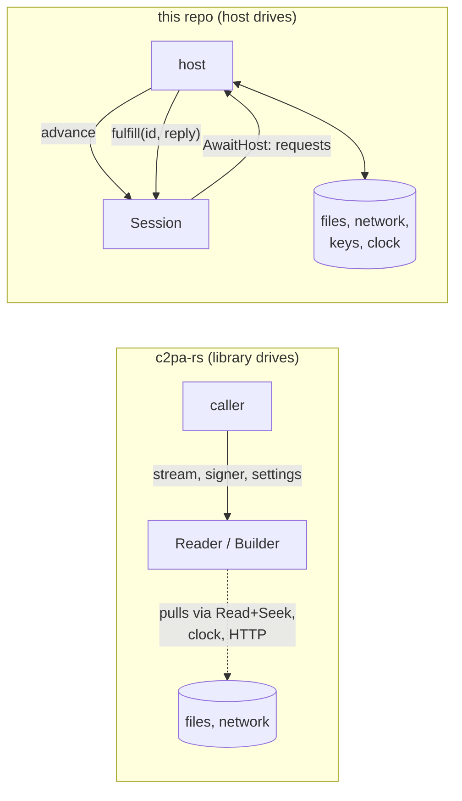
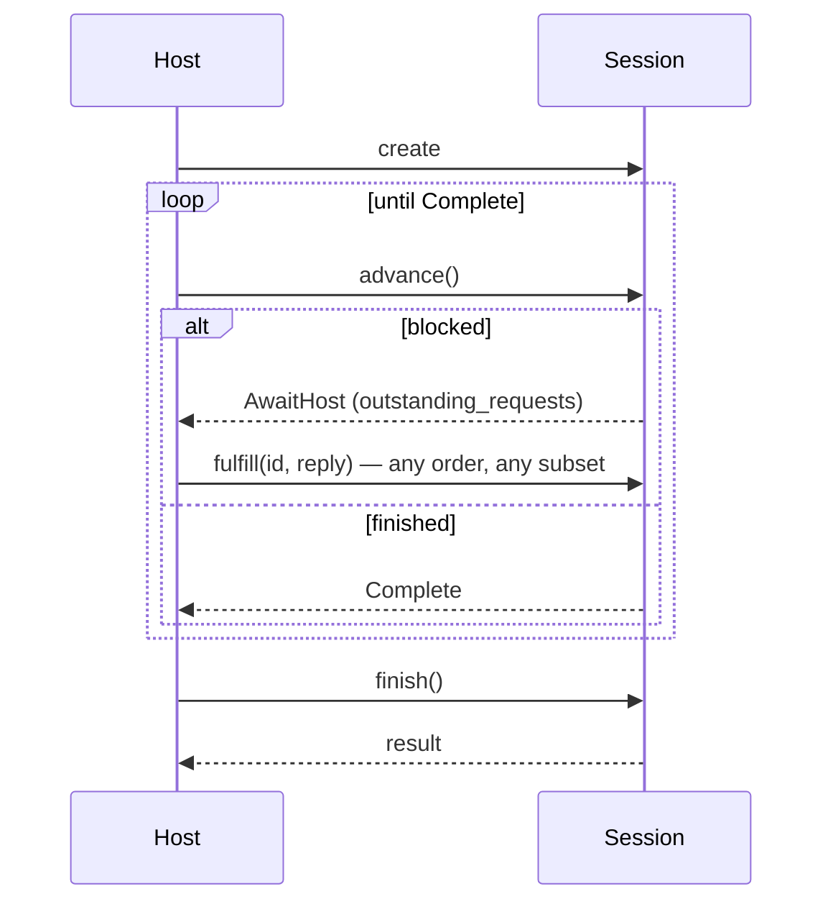

# 1. The idea, and how it differs from c2pa-rs

This page assumes you know c2pa-rs (`Reader`, `Builder`, `Store`, `Context`,
`Signer`/`AsyncSigner`) and its bindings (c2pa-wasm / c2pa-web, c2pa-node).
It is about what is *structurally* different here, not a tour of C2PA.

## The short version

In c2pa-rs, **the library drives**: it is handed a `Read + Seek` stream (or
a path), a signer, and settings, and it pulls bytes, the clock, and OCSP
responses itself. Each binding then has to reconcile that with its own
runtime.

Here, **the host drives**. The engine is a synchronous state machine that
never performs I/O. It parks itself with a set of requests ("give me bytes
`[a, b)` of stream 0", "what time is it", "POST this OCSP request", "sign
this"), the host answers however it likes, and calls `advance` again.

## What that changes, concretely

| Concern | c2pa-rs and its bindings | This project |
|---|---|---|
| **Who performs I/O** | The library, through `Read + Seek` / `Write`, its own HTTP stack, system clock | The host, always. The engine has no I/O, clock, RNG, thread, or runtime |
| **Sync vs async** | One core, synchronous at heart, with async variants (`with_stream_async`) for the parts that may hit the network | One core that is neither; async-ness is whatever the host wraps around the loop |
| **Asset bytes** | Must arrive as a synchronous `Read + Seek` stream | Arrive as *replies to range requests*, which can be answered asynchronously, out of order, or from a cache |
| **c2pa-wasm** | `BlobStream` over `FileReaderSync` → reader must live in a Web Worker | `Blob.slice().arrayBuffer()` awaited per request → works on the main thread, and two reads interleave at request boundaries (tested) |
| **c2pa-node** | Whole reads run on a process-wide tokio pool behind `Mutex<Reader>`; JS thread blocks on sync accessors | Rust is only ever *called* synchronously; Node owns `fs`/`fetch` and the event loop; no threads, locks, or `futures` in the addon |
| **Signing** | `Signer` (blocking) / `AsyncSigner`; node needs a `CallbackSigner` bridge into JS | `Sign`/`Timestamp` are just requests — a JS `Promise`, WebCrypto, or KMS call is the *normal* path, not a special one |
| **Concurrency** | Whatever the runtime provides | The session issues a *set* of requests (e.g. a window of 64 KiB hash-chunk reads); host overlaps them as it wishes |
| **Time** | System clock | A request (`CurrentDateTime`): reads are reproducible with a fixed "now" |
| **Container formats** | Handled inside c2pa-rs's asset-I/O layer | A plain-data contract (`FormatHandler`): handlers *describe* byte ranges and edit plans, never read or write; formats are separate crates |
| **Embedding** | Writes into an output stream | A handler returns an `EmbedPlan` (copy these ranges, emit this framing, leave these placeholders); an orchestrating session walks it |
| **Surface area** | Full SDK: ingredients, thumbnails, CAWG/identity, remote manifests, BMFF, … | A deliberately thin slice (see [future directions](09-future.md)); the point is the architecture, not feature parity |
| **Failure modes of the contract** | n/a | Protocol errors are first-class: fulfilling an unknown/duplicate request, finishing early |

## What stays the same

This is not a fork of c2pa-rs's logic. Two things are kept deliberately
close to it:

* **The public surface, in the compat crates.** `contentauth-c2pa-rs-compat`
  reproduces a slice of `Reader`/`Context`/`Manifest`, including error and
  JSON contracts; the js/node crates reproduce `WasmReader` and
  c2pa-node's `Reader` down to the error strings. Code written against
  those surfaces should not notice the engine underneath.
* **The bytes.** JPEG output is byte-identical to c2pa-rs's conventions;
  a differential harness reads files through both stacks and compares
  ([proof and CI](07-proof-and-ci.md)).

## What it costs (honest trade-offs)

* **Every request crosses the host boundary.** In Node that is a `Buffer`
  copy per chunk, where c2pa-node crosses once per call. Measured throughput
  suggests it is not the bottleneck, but it is the price.
* **Hashing happens on the host's thread**, in small slices between awaits.
  Moving it off-thread means running the session in a Worker — possible
  without changing the engine, but the host's job.
* **A second implementation to keep honest.** Reader/validator logic is
  written from scratch here, so conformance to c2pa-rs and to the spec is
  something to *keep proving*, not inherit.
* **Less coverage.** No ingredients, remote manifests, BMFF or thumbnails
  yet; CAWG identity assertions only for the X.509 credential type.

## The engine, for reference

Four calls, from the `Session` trait in
[`contentauth-state-machine/src/session.rs`](../../contentauth-state-machine/src/session.rs):

The engine crate has no C2PA logic: a request/reply vocabulary trait,
request tracking (`SessionCore`), and a protocol-error vocabulary. Concrete
workflows (reader, builder, and the file sessions that compose them) are
separate crates with their own request vocabularies. Sessions can *nest*:
a session answers some of an inner session's requests itself and forwards
only the rest, which is how format handling is wired in
([read path](03-read-path.md), [write path](04-write-path.md)).

**Next:** [Architecture →](02-architecture.md)
