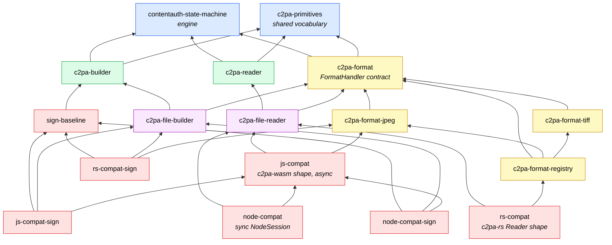
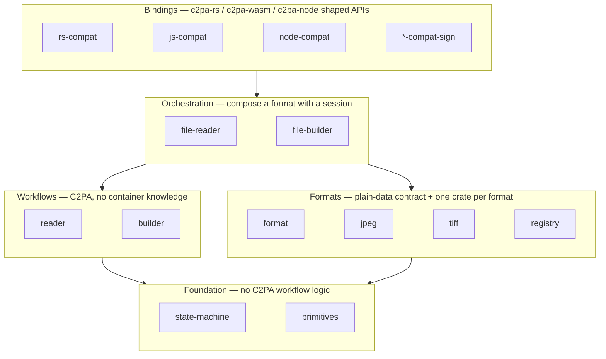

# 2. Architecture

About twenty crates sounds like a lot. They fall into layers, and the rule
that organizes them is: **each layer knows nothing about the ones above it,
and the reader, builder and format handlers know nothing about each other.**

## Dependency graph

Arrows point from a crate to what it depends on (workspace crates only).

(Edges to `primitives` and `state-machine` from most crates are omitted
where they would only add noise; every session crate depends on both.)

## Layers

## Crate table

| Crate | Layer | What it is |
|---|---|---|
| `contentauth-state-machine` | Foundation | The engine: `Session`, `SessionCore`, request tracking, protocol errors. Domain-agnostic. |
| `contentauth-c2pa-primitives` | Foundation | The narrow shared slice: `StreamId`, `ByteRange`, hash/signing algorithms, `HostError`, COSE `Sig_structure`, RFC 3161 encode/unwrap. |
| `contentauth-c2pa-reader` | Workflow | `ReadSession`: JUMBF, claims (v1+v2), integrity, signature, trust, timestamps, OCSP. |
| `contentauth-c2pa-builder` | Workflow | `BuilderSession`: v2 claim generation and signing via a two-pass placeholder scheme. |
| `contentauth-c2pa-format` | Format | `FormatHandler` trait, `FormatDescriptor`, `IoRequest`, `EmbedPlan`/`Patch`, test kit + conformance suite. |
| `…-format-jpeg` | Format | APP11 segments; byte-compatible with c2pa-rs. The template for other handlers. |
| `…-format-tiff` | Format | TIFF/BigTIFF/DNG; the format that forced `exclusions` to become a list. |
| `…-format-registry` | Format (host side) | Detect by content / extension / MIME; type-erased `AnyFormat`. |
| `…-file-reader` | Orchestration | `FileReadSession`: `locate` + `ReadSession`; plus a blocking `Read + Seek` host. |
| `…-file-builder` | Orchestration | `FileBuilderSession`: `plan_embed`/`commit` + `BuilderSession`, never buffering the asset; plus blocking hosts. |
| `…-rs-compat` | Binding | c2pa-rs `Context` + `Reader::with_file` slice; one of two crates with a network dependency (`reqwest` OCSP). |
| `…-js-compat` | Binding | c2pa-wasm `WasmReader` slice; async host with `Blob`/`Platform` traits; `web` feature for `wasm-bindgen`. |
| `…-node-compat` (+ `c2pa-node-compat-addon`) | Binding | Purely synchronous `NodeSession`; Node owns all async. Addon is a separate Neon workspace. |
| `…-sign-baseline` | Binding | The baseline signing case (JSON definition → `BuilderSettings`) every write binding is held to. |
| `…-rs/js/node-compat-sign` (+ `c2pa-node-sign-addon`) | Binding | The baseline case through each binding. `rs-compat-sign` is the other crate with a network dependency (`reqwest` for RFC 3161 timestamps). |
| `c2pa-rs-compat-conformance` | Test | Separate workspace; differential tests against the real `c2pa` crate. |

## Rules of the road

* **Reader and builder never mention a container format.** They ask for "the
  manifest store's bytes" or "embed this placeholder and report its range".
* **Formats never mention a session.** A handler speaks only `IoRequest`
  and returns plain data.
* **Only the registry names more than one format**, behind features.
* **Nothing is async below the host.** Even `js-compat`, the async one, has
  its `.await`s in a single function.
* **Lints enforce discipline:** `unsafe_code`, `missing_docs`,
  `unwrap_used`, `expect_used`, `panic` are denied at crate roots.

**Next:** [The read path →](03-read-path.md)
