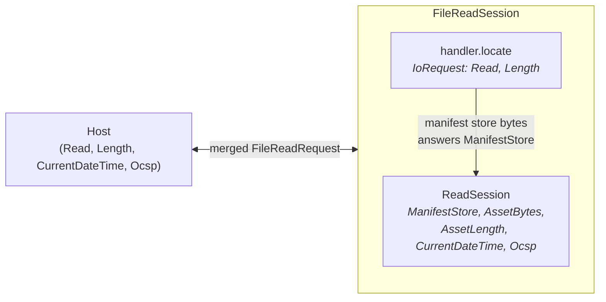
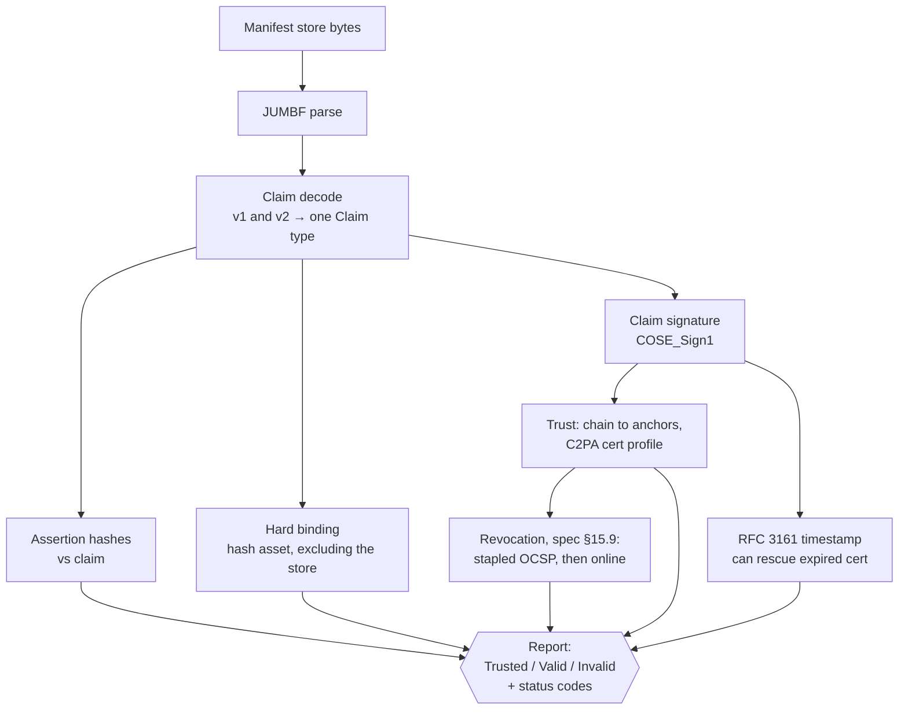
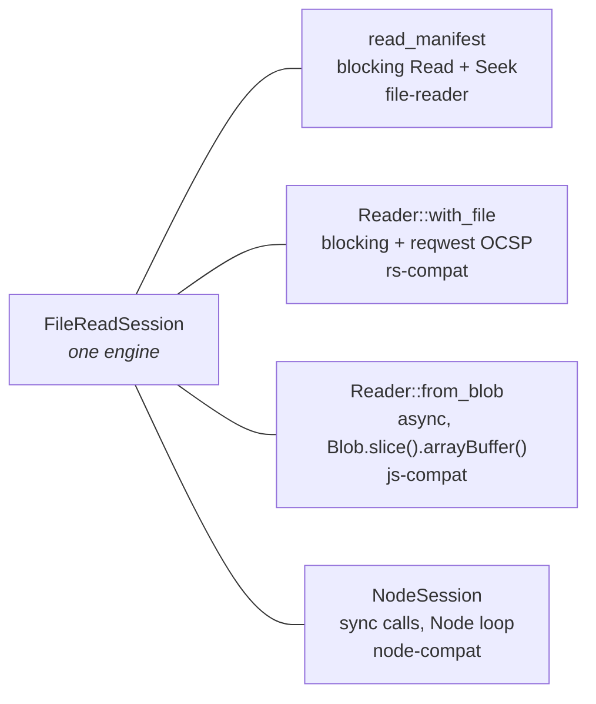

# 3. The read path

## Two sessions, nested

`ReadSession` (in `contentauth-c2pa-reader`) validates a manifest store but
has no idea what a JPEG is. `FileReadSession` (in `contentauth-c2pa-file-reader`)
wraps it with a format handler's `locate` operation, and **answers one of
the reader's requests itself**.

`ReadRequest::ManifestStore` never reaches the host. The host answers one
merged vocabulary — `FileReadRequest::{Read, Length, CurrentDateTime, Ocsp}`
— exactly as any other session's host would.

## What `ReadSession` validates

* **Integrity** — assertion hashes; the hard binding hashed in-crate from
  chunks the host streams (a window of concurrent 64 KiB reads).
* **Trust** — chain building against configured anchors; reports which
  trust list matched.
* **Timestamps** — a trusted RFC 3161 stamp keeps a since-expired signer
  valid.
* **Revocation** — OCSP only. Stapled first, then online (default on). An
  *unreachable* responder is fail-open; a response that is received and
  authenticated but doesn't affirmatively vouch counts as revoked.
* **v1 and v2 claims** decode into the same `Claim`; v2 required-field
  and self-redaction checks are enforced.

Not yet checked: ingredient manifests, remote manifest retrieval,
`assertion.notRedacted`.

## Request vocabulary (reader)

| Request | Purpose |
|---|---|
| `ManifestStore { stream }` | Get the JUMBF store out of the container |
| `AssetBytes { stream, range }` | Bytes for hard-binding verification |
| `AssetLength { stream }` | Needed since the binding names only what to *exclude* |
| `CurrentDateTime` | Cert validity windows; the crate reads no clock |
| `Ocsp { url, request_der }` | Host does only the HTTP POST |

Any request can be answered with `Failed`, but the outcome differs by
request. A host author should not treat an asset read failure as a normal
validation result:

| Request answered `Failed` | Outcome |
|---|---|
| `ManifestStore` | **Read stops** with `Error::HostFailure`; no report |
| `AssetBytes` | **Read stops** with `Error::HostFailure`; no report |
| `AssetLength` | Report is produced; the hard binding is recorded as not checked (`general.error`, "asset not available") |
| `CurrentDateTime` | Report is produced; trust is evaluated without a "now", so only signatures carrying a trusted timestamp can be fully evaluated |
| `Ocsp` | Report is produced. A CA certificate's unreachable responder is no finding; the signer's is recorded as `signingCredential.ocsp.inaccessible` |

In the builder, by contrast, every host failure is fatal.

## Three hosts for one session

See [Bindings](06-bindings.md).

**Next:** [The write path →](04-write-path.md)
