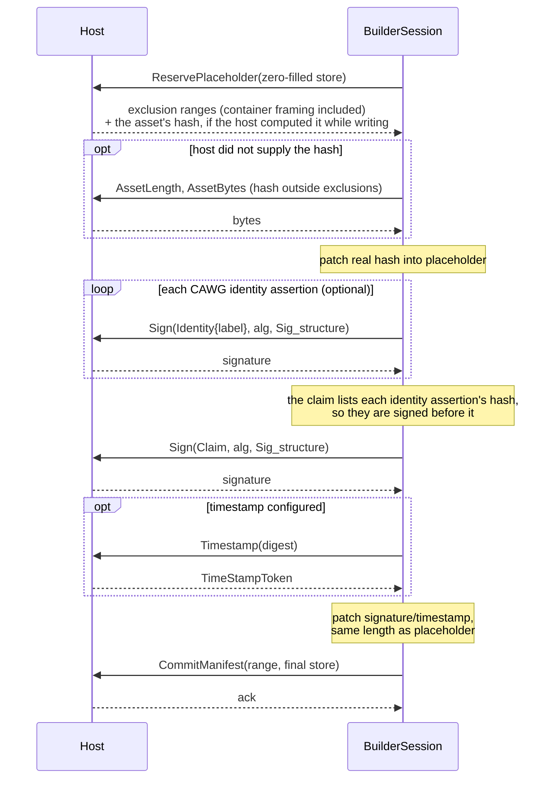
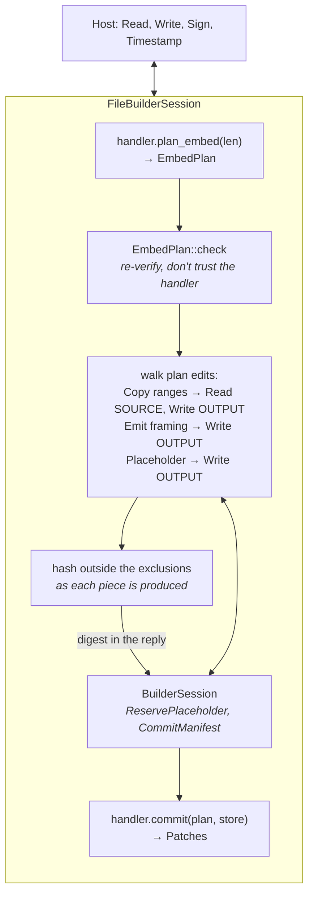

# 4. The write path

## The circularity

A `c2pa.hash.data` hard binding must hash the asset **excluding the
manifest's own bytes**. But:

* where those bytes land depends on the container format, and
* the manifest's content (hash, signature, timestamp) isn't known until
  after hashing.

`BuilderSession` resolves this in one round trip with a **placeholder**: a
complete manifest store whose variable fields are zero-filled at exactly
their final encoded length.

Every value that changes between passes is fixed-length (a digest, a
signature at a declared length) or backed by an exactly-computed padding
field, so the buffer's length never changes and the patch always fits.
Exclusions are a **list** (up to `MAX_EXCLUSIONS` = 4, padded) — because TIFF
needs two ([formats](05-formats.md)).

## Composing with a format: `FileBuilderSession`

The host's asset I/O is not a single stream. `FileBuilderSession` composes
a handler's `plan_embed`/`commit` with `BuilderSession` and speaks
`FileBuilderRequest::{Read(SOURCE), Write(OUTPUT), Sign, Timestamp}`.

Design decisions worth discussing:

* **Never buffers the asset.** It never calls `EmbedPlan::materialize`
  (the in-memory reference implementation); large `Copy` edits are chunked.
* **Doesn't trust the handler.** The plan is re-checked against a freshly
  asked source length.
* **One pass.** The plan describes the whole output before any of it
  exists and its edits are walked in output order, so the hard binding's
  digest is accumulated *as the output is produced* — a copied range as
  soon as its source read returns, framing as it is emitted, the manifest's
  slot not at all — and rides back in `ReservePlaceholder`'s reply. The
  session never asks for `AssetLength`/`AssetBytes`, the output is never
  read back (a write-only stream will do), and a reused, longer output
  stream can't leak stale trailing bytes into the hash (they are still
  physically in the file; pass an empty stream if that matters). A host
  that can't hash as it goes leaves `hash` empty and answers
  `AssetBytes` as before; `BuilderSession` supports both.
* **Why this works for RIFF and not (yet) for everything.** It needs every
  byte outside the exclusions to be known when it is written. RIFF's only
  manifest-dependent byte outside the new chunk is the header's size
  field, which depends on the store's *length*; BMFF's chunk offsets also
  shift, which is [future work](09-future.md).
* **Only `Sign` and `Timestamp` reach the host as themselves** — nothing
  here can sign for a host.
* **`build_and_sign_file` is safe by construction:** exclusive-create
  temporary file with an unpredictable name beside the target, renamed into
  place only on success, removed on failure on a best-effort basis (if the removal itself fails, a temporary file can be left behind; the output path is untouched either way).

## What gets built today

One manifest, v2 claim only (v1 is read-only — the spec forbids generators
writing it), `c2pa.hash.data`, caller-supplied assertions marked `Created`
or `Gathered`, all C2PA signing algorithms, optional RFC 3161 timestamp.
Out of scope: ingredients, update manifests, BMFF/box hashes, cert
validation (host vouches for the chain).

**Next:** [Container formats →](05-formats.md)
