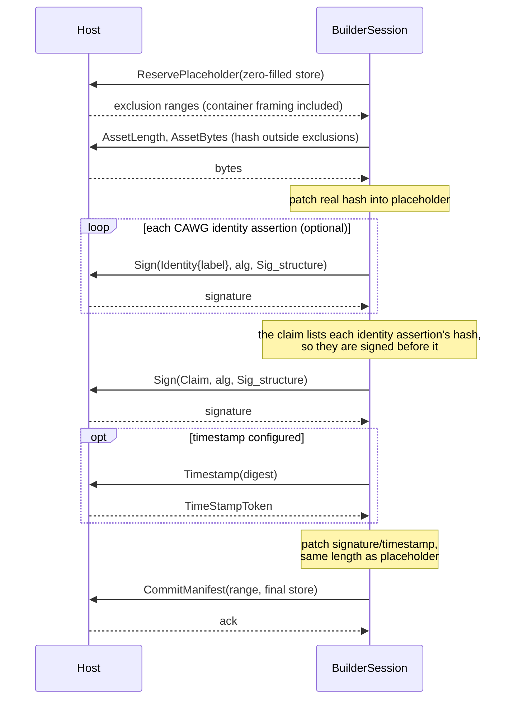
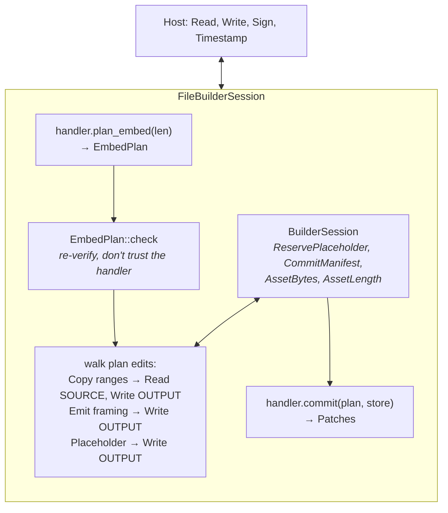
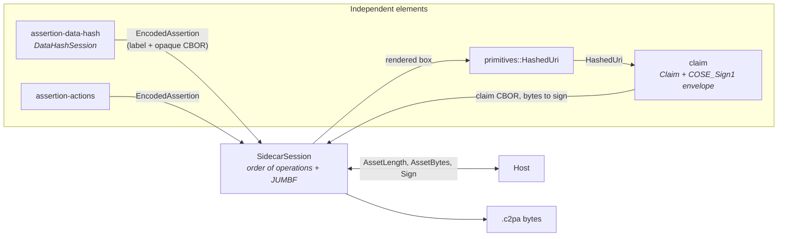

# 4. The write path

## The circularity

A `c2pa.hash.data` hard binding must hash the asset **excluding the
manifest's own bytes**. But:

* where those bytes land depends on the container format, and
* the manifest's content (hash, signature, timestamp) isn't known until
  after hashing.

`BuilderSession` resolves this in one round trip with a **placeholder**: a
complete manifest store whose variable fields are zero-filled at exactly
their final encoded length.

Every value that changes between passes is fixed-length (a digest, a
signature at a declared length) or backed by an exactly-computed padding
field, so the buffer's length never changes and the patch always fits.
Exclusions are a **list** (up to `MAX_EXCLUSIONS` = 4, padded) — because TIFF
needs two ([formats](05-formats.md)).

## Composing with a format: `FileBuilderSession`

The host's asset I/O is not a single stream. `FileBuilderSession` composes
a handler's `plan_embed`/`commit` with `BuilderSession` and speaks
`FileBuilderRequest::{Read(SOURCE), Write(OUTPUT), Sign, Timestamp}`.

Design decisions worth discussing:

* **Never buffers the asset.** It never calls `EmbedPlan::materialize`
  (the in-memory reference implementation); large `Copy` edits are chunked.
* **Doesn't trust the handler.** The plan is re-checked against a freshly
  asked source length.
* **`AssetLength` is answered from the plan**, not the host, so a reused,
  longer output stream can't leak stale trailing bytes into the hash
  (they are still physically in the file; pass an empty stream if that
  matters).
* **Only `Sign` and `Timestamp` reach the host as themselves** — nothing
  here can sign for a host.
* **`build_and_sign_file` is safe by construction:** exclusive-create
  temporary file with an unpredictable name beside the target, renamed into
  place only on success, removed on failure on a best-effort basis (if the removal itself fails, a temporary file can be left behind; the output path is untouched either way).

## Sidecar manifests

A sidecar (`.c2pa` beside the asset) needs none of the above: nothing is
embedded, so there is no placeholder, no exclusion and no second pass. The
asset is hashed whole, once, **before** the claim exists. `SidecarSession`
(`contentauth-c2pa-sidecar-builder`) is therefore much smaller, and it is
built the other way round from `BuilderSession`: not one crate that knows
everything, but a composition of independent elements.

What crosses each seam is plain: assertions are a label and CBOR bytes the
session never looks inside; a `HashedUri` is a URL and a digest; the claim
holds `HashedUri`s, never assertions. The hard binding is driven as a
sub-session whose requests the parent forwards to its host. JUMBF is the
one thing the session itself does, with the `jumbf` crate: each assertion
box is rendered **once**, hashed, and spliced into the store as-is (see the
[measurements](../../c2pa-core-comparison/README.md)).

Validated against this workspace's reader and against the real c2pa-rs
0.91.2 (`Reader::with_manifest_data_and_stream`). The use case is that of
Gavin Peacock's `c2pa-sign-sample`; `cargo run -p
contentauth-c2pa-sidecar-builder --example sign_sidecar -- FILE` is its
counterpart.

## What gets built today

One manifest, v2 claim only (v1 is read-only — the spec forbids generators
writing it), `c2pa.hash.data`, caller-supplied assertions marked `Created`
or `Gathered`, all C2PA signing algorithms, optional RFC 3161 timestamp.
Out of scope: ingredients, update manifests, BMFF/box hashes, cert
validation (host vouches for the chain). Sidecars: created assertions only, no
timestamp or identity yet.

**Next:** [Container formats →](05-formats.md)
