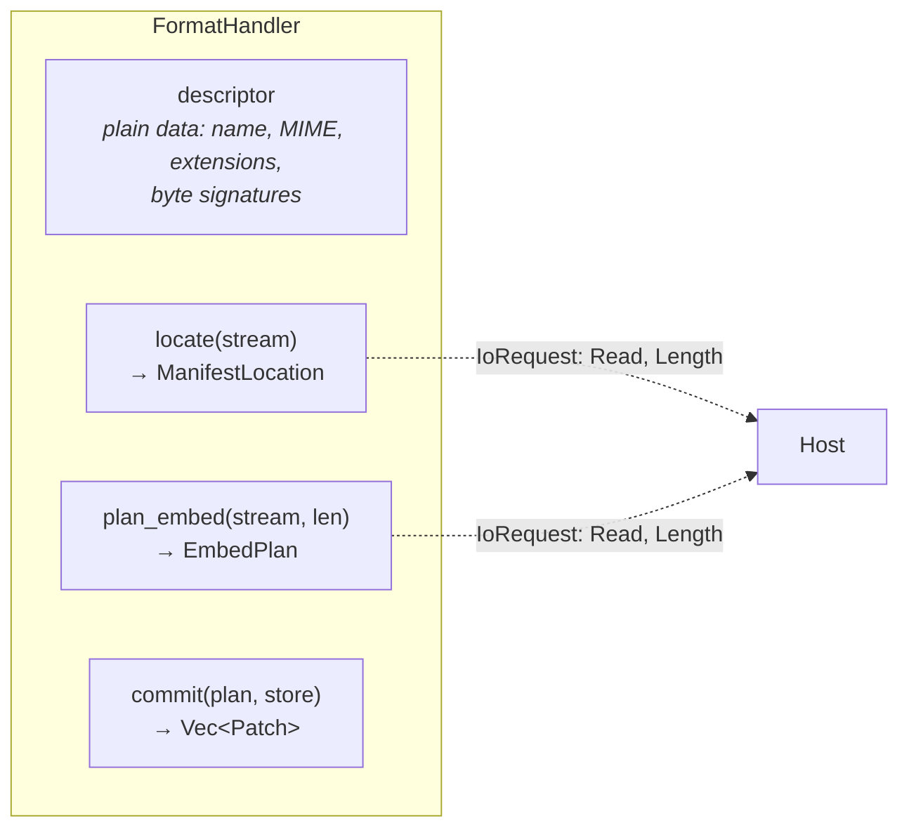
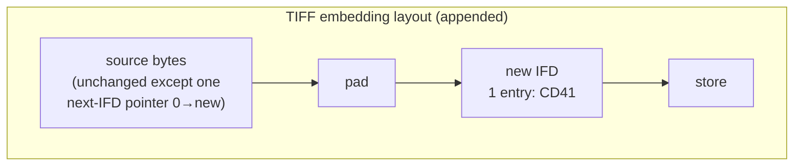
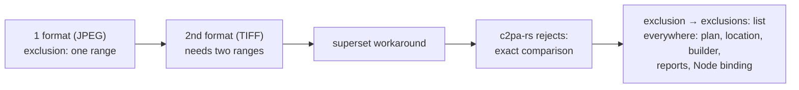
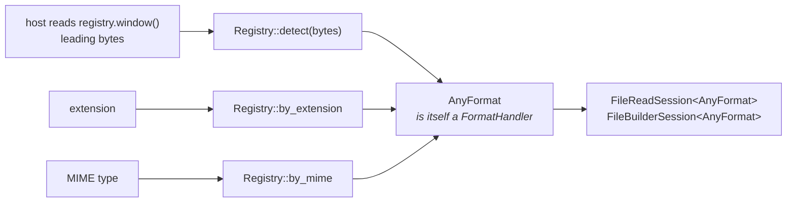

# 5. Container formats

In c2pa-rs, format support lives inside the SDK's asset-I/O layer. Here it
is a **contract**, and each format is its own crate that the reader,
builder and engine never depend on.

## What a handler is

* `locate` and `plan_embed` read the asset, so each is itself a session
  speaking `IoRequest::{Read, Length}`.
* **A handler never writes.** It *describes* the output as an `EmbedPlan`:
  a list of `Edit`s — `Copy(range)`, `Emit(bytes)`, `Placeholder(range)` —
  plus the hard-binding `exclusions` and any replaced range.
* Everything crossing the boundary is plain data: no callbacks, no
  borrowed streams. That makes handlers testable against a byte slice, lets
  an orchestrator compute the hard-binding hash from the plan without
  writing the output, and keeps the boundary crossable from other
  languages.

## Two handlers, chosen to differ

| | JPEG | TIFF / BigTIFF / DNG |
|---|---|---|
| Structure | Sequence of marker segments | Graph of offsets (header → IFD → next IFD; entries → data anywhere) |
| Store lives in | `APP11` segments (`JP` preamble, 64,000-byte slices) | Data of IFD tag `0xCD41` |
| Reading | One sequential scan | Pointer-chasing at file-dictated offsets, each bounds-checked; loops and absurd counts refused |
| Embedding | Insert new segments | Nothing may move: append a new trailing IFD + store; rewrite **one** next-IFD pointer |
| Exclusions | One range (segment run) | **Two, non-adjacent**: the entry's `count` field and the store |
| Byte order / width | One | Either order; classic and BigTIFF (alignment padding) |
| `commit` patches | None | None (framing depends only on store length) |

The rewritten pointer sits *outside* the exclusion, so it is hashed into
the binding — redirecting it to hide the store breaks the signature
(tested).

## What TIFF taught the contract

`EmbedPlan` originally had **one** exclusion range. TIFF's spec excludes
two separate things, so the first TIFF handler reported a contiguous
superset. **c2pa-rs rejected it**: its validator compares exclusions
exactly (`assertion.dataHash.mismatch`). This was invisible until the
workspace could write something c2pa-rs reads.

Lesson: a second, structurally different format is worth far more than a
third similar one — and differential testing against c2pa-rs finds what
self-consistency can't.

## Choosing a format: the registry (host-side)

* Detection is a **pure function of bytes the host already has**; the
  registry reads nothing.
* **Policy is the host's.** Content is evidence; a file name is a claim.
  `rs-compat` says: content first, extension second, else unsupported.
* Formats are cargo features of the registry — the only crate naming more
  than one.

## Adding a format

New crate implementing `FormatHandler`, passing
`contentauth_c2pa_format::test_util::conformance::run_all`, then a
registration. **Nothing in the reader, builder, or contract crate changes.**

**Next:** [Bindings →](06-bindings.md)
