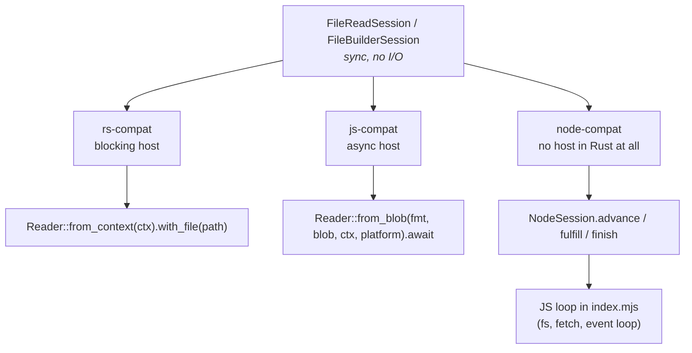
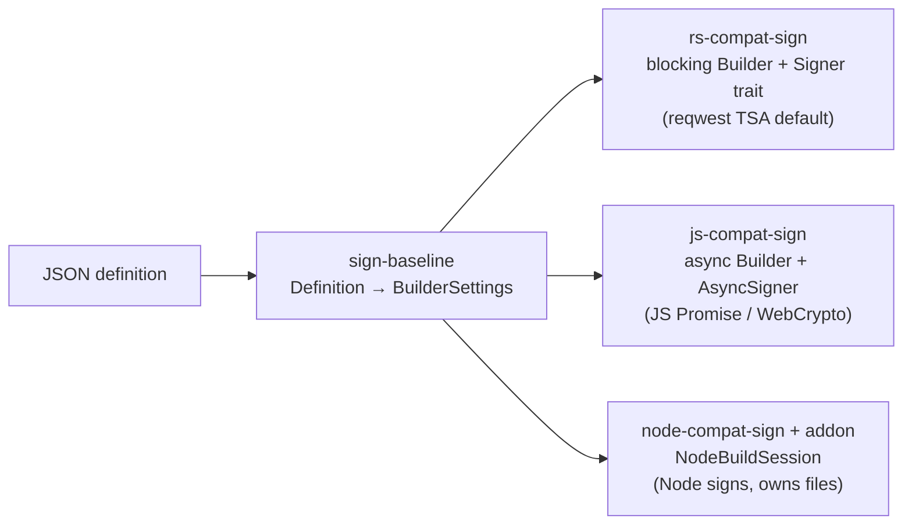

# 6. Bindings: one engine, three asynchrony models

Each compat crate reproduces a *slice* of a real public surface — same
method names, same error strings, same JSON — and differs only in **where
the asynchrony lives**.

| Binding | Mirrors | Async lives in | Notable |
|---|---|---|---|
| `rs-compat` | c2pa-rs `Context`, `Reader`, `Manifest` | Nowhere — blocking | Only network dependency: `reqwest` answers `Ocsp`. Owns format *policy* (`src/format.rs`). |
| `js-compat` | c2pa-wasm `WasmReader` | One `async fn` driving the session (`src/drive.rs`) | `Blob` ≈ `Blob.size` + `slice().arrayBuffer()`; `Platform` supplies clock/OCSP, which c2pa-rs gets implicitly. `web` feature adds a `#[wasm_bindgen]` `WasmReader`. |
| `node-compat` | c2pa-node `Reader` | Node itself | Rust has no runtime, threads, locks, or `async`. 4 synchronous exports (~150 lines of Neon). |

## Where the c2pa-rs shapes break down

Honest differences, found by building these:

* **`Platform` is a new argument.** `fromBlob` has none; a sans-I/O engine
  must be *handed* the clock and OCSP transport explicitly.
* **OCSP defaults differ.** The engine defaults OCSP on; c2pa-rs's settings
  default it off, so `js-compat` maps the absent setting to off.
* **OCSP URLs are untrusted input** (they come from the asset's cert). The
  Node driver applies a policy (http(s) only, no credentials, no
  loopback/private literals), never follows redirects, and bounds the
  response at 1 MiB.
* **Reader state is a snapshot.** Node's `Reader` is parsed JSON, not a
  mutex-guarded live object.

## What the tests show

* `js-compat`: a `Blob` whose every read genuinely suspends, on a
  hand-rolled executor (no runtime dependency): completes correctly;
  yields once per request; **two reads interleave on one thread** — what a
  `FileReaderSync` stream can't do.
* `node-compat` addon: path / buffer / custom async source give identical
  JSON; timers fire throughout a slow read; eight reads interleave in well
  under serial time.
* Measured (256 MB, every byte hashed, release build): 510 MB/s at
  concurrency 1, 773 MB/s at 8, event-loop delay p99 ≈ 1.2–1.6 ms.

## The write side: the baseline signing case

`sign-baseline` fixes one scenario every binding must pass: JPEG +
c2pa-rs-shaped JSON (title, one generator, one `c2pa.actions.v2` /
`c2pa.created`) + ES256 → reads back `Trusted`.

* The signer is where the models diverge most: a blocking trait, an
  `async` trait that a browser backs with a non-extractable WebCrypto key
  that never enters Wasm memory, and a Node callback — the *normal* path,
  not a `CallbackSigner` special case.
* `instance_id` and `label` are required in the definition: the engine has
  no RNG, so the host mints them.
* An optional `tsa_url` opts into an RFC 3161 timestamp; each binding
  leaves only the HTTP `POST` to its host.

**Next:** [Proof and CI →](07-proof-and-ci.md)
