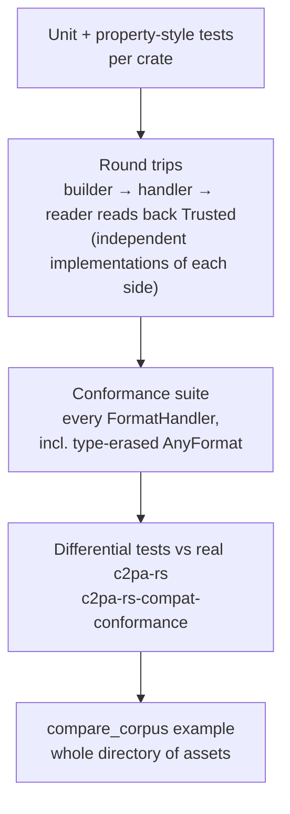
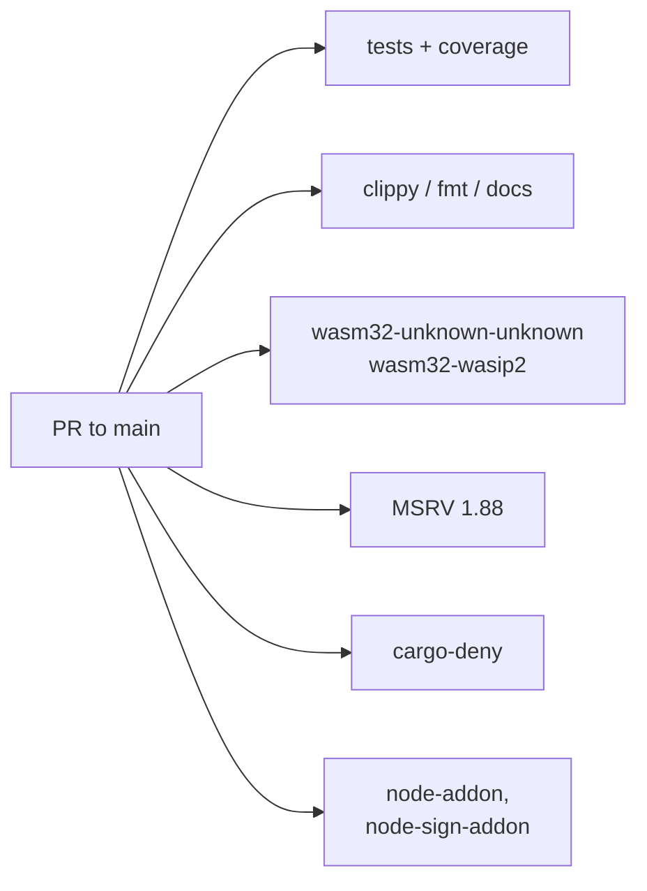

# 7. Proof and CI

A from-scratch reader/validator is only worth anything if it agrees with
the implementations people already trust. The evidence comes in layers.

* **Round trip.** The builder's primary correctness proof is that
  `contentauth-c2pa-reader` — written independently — reads what it
  builds as `Trusted`. Tamper tests flip image bytes or the rewritten TIFF
  pointer and expect failure.
* **Conformance kit.** `test_util::conformance::run_all` is what a new
  format handler must pass.
* **Differential testing against c2pa-rs.** A separate workspace (so the
  heavy `c2pa` crate doesn't burden this one's Wasm/MSRV/`cargo-deny`
  checks): the same client code reads a file through c2pa-rs and through
  `rs-compat` and compares. Both directions for TIFF — c2pa-rs-signed read
  here, and signed here read by c2pa-rs. This is what exposed the
  exclusions bug.
* **Corpus runner.** `compare_corpus` walks a directory (e.g. a checkout of
  c2pa-org's `public-testfiles`) and reports every disagreement. It has not
  yet been pointed at a large corpus — see [future](09-future.md).

## CI

`.github/workflows/ci.yml`, as separate jobs: unit tests + Codecov, doc
tests, Clippy (`-Dwarnings`), nightly rustfmt, rustdoc (warnings denied),
Wasm checks, MSRV (1.88.0), `cargo-deny`; plus separate jobs for the two
Neon addons (`node-addon`, `node-sign-addon`).

The Wasm checks are a design assertion: **the engine and everything over it
builds for Wasm unmodified**. Exempt: `rs-compat` and `rs-compat-sign`,
which deliberately own the workspace's only network dependencies. The `web`
modules are only *compiled*, not run — there is no browser in CI.

**Next:** [Findings →](08-findings.md)
