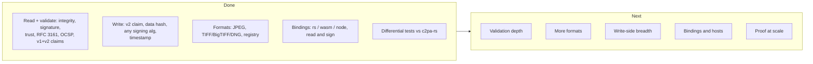

# 9. Future directions

Everything below is drawn from the "not covered yet" sections of the crate
READMEs; none of it is committed work. Grouped by what it would teach us.

## Where we are

## 1. Validation depth (reader)

| Item | Why it matters |
|---|---|
| **Ingredients / parent manifests** | Largest functional gap. Needs the reader to recurse over manifests; likely new request shape for ingredient assets. |
| **Redaction checks** (`assertion.notRedacted`) | Depends on ingredients. |
| **Remote manifest retrieval** | `ReadSettings::fetch_remote_manifests` is documented but nothing issues the request: needs an `HttpFetch`-style request. A natural test of "the host owns the network". |
| **CRLs** | Outside the spec §15.9 OCSP-only process the engine follows, but real certs use them. |
| **Other hard bindings** (box hash, BMFF) | Only `c2pa.hash.data` is validated. |
| **Decoded assertion values** (thumbnails, resources) | Needed for fuller `ManifestStore` and `crJson`/`resourceToBytes` parity. |

## 2. More container formats

The template is established: a crate + the conformance suite, nothing else
changes. Choose formats for *what they exercise*, as TIFF did:

* **PNG** — chunks with CRCs, the first real use of `commit` patches.
* **BMFF (HEIC/AVIF/MP4)** — box-hash binding; fragmented BMFF is also
  what `fromBlobFragment` needs (two `Blob`s).
* **RIFF (WAV/WebP/AVI)** — rewrites an existing size field, which `Edit::Emit`
  already anticipates.
* **PDF, sidecar/`.c2pa`, and others** — non-embedding or very different
  shapes.
* **XMP remote-reference parsing** in the existing handlers.
* **Formats in other languages** — the registry README sketches
  `DynFormatHandler` over a Wasm component, a JS generator, or a C ABI.
  The open parts are marshalling `EmbedPlan` safely and a conformance
  corpus that is *data*, loadable from any language.

## 3. Write-side breadth

* **Ingredients and update manifests** (the builder's biggest gap;
  `redacted_assertions` has no use without them).
* **Policy for already-signed assets**: `plan_embed` always replaces;
  whether to carry the old store forward as a parent is the caller's call —
  currently nobody makes it.
* **An orchestrator** that can juggle more than source and output streams
  (ingredient assets) — what the file-builder/file-reader READMEs point to.
* **Box-hash / BMFF bindings, certificate decoding/validation** on the
  write side (today the host vouches for the chain).
* **Generator `icon`**, richer assertion helpers.

## 4. Bindings and hosts

* **`Builder` surface parity** for the c2pa-rs shape beyond the baseline
  case; `from_stream` and other constructors.
* **c2pa-node:** `fromManifestDataAndAsset`, `resourceToAsset`, signers,
  identity assertions, Trustmark.
* **Browser:** a `fetch`-backed OCSP `Platform`; actually *running* the
  `web` modules (there's no browser in CI today); a Worker-hosted session
  for hashing off the main thread.
* **Other host languages** — Python, Swift, Kotlin, .NET: the Node binding
  shows the minimal shape (a handful of synchronous functions plus a host
  loop). Each is a good test of whether the flattened `PendingRequest`/
  `Reply` data model is the right wire format.
* **A WIT / Wasm component** exposing `advance`/`fulfill`/`finish` as the
  language-neutral form of the contract.
* **Cancellation and progress** — c2pa-rs's `Context` has them; here they'd
  be natural (stop calling `advance`; observe requests) but untested.

## 5. Proof at scale

* **Run `compare_corpus` against `public-testfiles`** and triage the
  disagreements. This is the highest-value next step for deciding whether
  the validator is trustworthy.
* **Track c2pa-rs releases** — the compat layer follows a moving target.
* **Fuzzing** the parsers (JUMBF, COSE, TIFF graph walks) — they already
  refuse hostile input by design, but nothing yet hammers that.
* **Benchmarks** against c2pa-rs for large assets (the Node numbers are
  encouraging but not comparative).

## 6. Merging with `asset-io`

A proposal for combining this work with Gavin Peacock's
[`asset-io`](https://github.com/gpeacock/asset-io) (no-copy reads, fast
writes, parallel and box hashing, fuzzing) is in
[`../asset-io-merge-plan.md`](../asset-io-merge-plan.md), including an
analysis of where its callback-based APIs conflict with the sans-I/O model.
A companion review of his `c2pa-core` experiment is in
[`../c2pa-core-review.md`](../c2pa-core-review.md).

## Questions for discussion

1. Is "host drives" worth the boundary cost for the bindings we ship?
   Which binding benefits most?
2. Should this stay a compat layer, or inform a change in how c2pa-rs
   itself exposes its I/O?
3. Which of the above would *change the architecture* if tackled (we think:
   ingredients, remote manifests) versus merely extend it (formats)?
4. Is the `Session` contract the right granularity, or should a coarser
   "run to completion with this host trait" API sit on top for most users?
